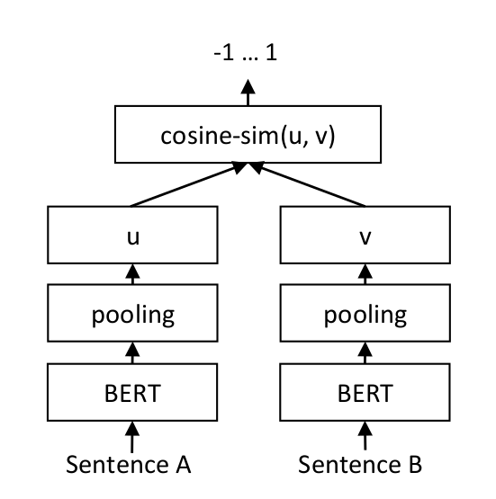

# Losses
`sentence_transformers.losses` define different loss functions, that can be used to fine-tune the network on training data. The loss function plays a critical role when fine-tuning the model. It determines how well our embedding model will work for the specific downstream task.

Sadly there is no "one size fits all" loss function. Which loss function is suitable depends on the available training data and on the target task.


## BatchAllTripletLoss
```eval_rst
.. autoclass:: sentence_transformers.losses.BatchAllTripletLoss
```

## BatchHardSoftMarginTripletLoss
```eval_rst
.. autoclass:: sentence_transformers.losses.BatchHardSoftMarginTripletLoss
```

## BatchHardTripletLoss
```eval_rst
.. autoclass:: sentence_transformers.losses.BatchHardTripletLoss
```

## BatchSemiHardTripletLoss
```eval_rst
.. autoclass:: sentence_transformers.losses.BatchSemiHardTripletLoss
```

## ContrastiveLoss
```eval_rst
.. autoclass:: sentence_transformers.losses.ContrastiveLoss
```


## CosineSimilarityLoss




For each sentence pair, we pass sentence A and sentence B through our network which yields the embeddings *u* und *v*. The similarity of these embeddings is computed using cosine similarity and the result is compared to the gold similarity score. 

This allows our network to be fine-tuned to recognize the similarity of sentences.


```eval_rst
.. autoclass:: sentence_transformers.losses.CosineSimilarityLoss
```

## DenoisingAutoEncoderLoss

```eval_rst
.. autoclass:: sentence_transformers.losses.DenoisingAutoEncoderLoss
```

## MegaBatchMarginLoss

```eval_rst
.. autoclass:: sentence_transformers.losses.MegaBatchMarginLoss
```

## MSELoss
```eval_rst
.. autoclass:: sentence_transformers.losses.MSELoss
```


## MultipleNegativesRankingLoss

*MultipleNegativesRankingLoss* is a great loss function if you only have positive pairs, for example, only pairs of similar texts like pairs of paraphrases, pairs of duplicate questions, pairs of (query, response), or pairs of (source_language, target_language).

```eval_rst
.. autoclass:: sentence_transformers.losses.MultipleNegativesRankingLoss
```


## OnlineContrastiveLoss
```eval_rst
.. autoclass:: sentence_transformers.losses.OnlineContrastiveLoss
```


## SoftmaxLoss
```eval_rst
.. autoclass:: sentence_transformers.losses.SoftmaxLoss
```

## TripletLoss
```eval_rst
.. autoclass:: sentence_transformers.losses.TripletLoss
```

