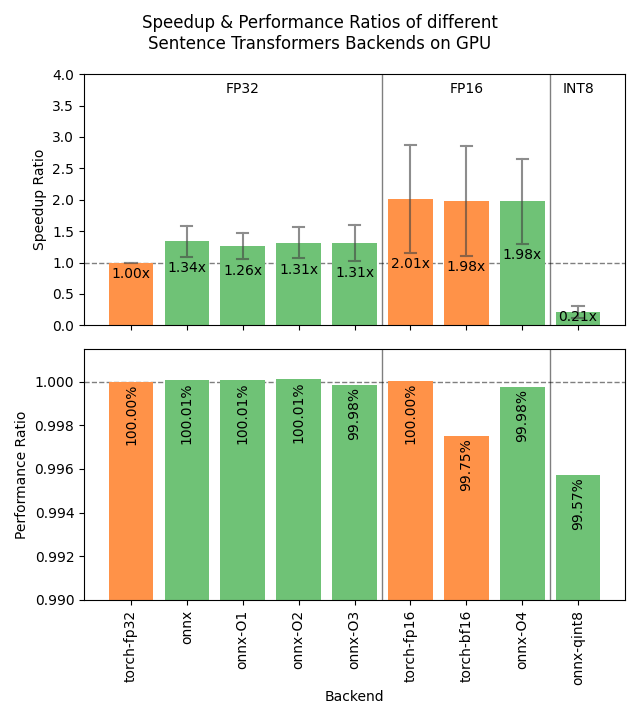

Speeding up Inference
=====================

Sentence Transformers supports 3 backends for computing embeddings, each with its own optimizations for speeding up inference:

.. raw:: html

    

        <a href="#pytorch" class="box">
            
PyTorch

            The default backend for Sentence Transformers.
        </a>
        <a href="#onnx" class="box">
            
ONNX

            Flexible and efficient model accelerator.
        </a>
        <a href="#openvino" class="box">
            
OpenVINO

            Optimization of models, primarily for Intel Hardware.
        </a>
        <a href="#benchmarks" class="box">
            
Benchmarks

            Benchmarks for the different backends.
        </a>
    

     

PyTorch
-------

The PyTorch backend is the default backend for Sentence Transformers. If you don't specify a device, it will use the strongest available option across "cuda", "mps", and "cpu". Its default usage looks like this:

.. code-block:: python

   from sentence_transformers import SentenceTransformer
   
   model = SentenceTransformer("all-MiniLM-L6-v2")

   sentences = ["This is an example sentence", "Each sentence is converted"]
   embeddings = model.encode(sentences)

If you're using a GPU, then you can use the following options to speed up your inference:

.. tab:: float16 (fp16)

   Float32 (fp32, full precision) is the default floating-point format in ``torch``, whereas float16 (fp16, half precision) is a reduced-precision floating-point format that can speed up inference on GPUs at a minimal loss of model accuracy. To use it, you can specify the ``torch_dtype`` during initialization or call :meth:`model.half() <torch.Tensor.half>` on the initialized model:

   .. code-block:: python

      from sentence_transformers import SentenceTransformer

      model = SentenceTransformer("all-MiniLM-L6-v2", model_kwargs={"torch_dtype": "float16"})
      # or: model.half()

      sentences = ["This is an example sentence", "Each sentence is converted"]
      embeddings = model.encode(sentences)

.. tab:: bfloat16 (bf16)

   Bfloat16 (bf16) is similar to fp16, but preserves more of the original accuracy of fp32. To use it, you can specify the ``torch_dtype`` during initialization or call :meth:`model.bfloat16() <torch.Tensor.bfloat16>` on the initialized model:

   .. code-block:: python

      from sentence_transformers import SentenceTransformer

      model = SentenceTransformer("all-MiniLM-L6-v2", model_kwargs={"torch_dtype": "bfloat16"})
      # or: model.bfloat16()

      sentences = ["This is an example sentence", "Each sentence is converted"]
      embeddings = model.encode(sentences)

ONNX
----

ONNX can be used to speed up inference by converting the model to ONNX format and using ONNX Runtime to run the model. To use the ONNX backend, you must install Sentence Transformers with the ``onnx`` or ``onnx-gpu`` extra for CPU or GPU acceleration, respectively:

.. code-block:: bash

   pip install sentence-transformers[onnx-gpu]
   # or
   pip install sentence-transformers[onnx]

To convert a model to ONNX format, you can use the following code:

.. code-block:: python

   from sentence_transformers import SentenceTransformer

   model = SentenceTransformer("all-MiniLM-L6-v2", backend="onnx")
   
   sentences = ["This is an example sentence", "Each sentence is converted"]
   embeddings = model.encode(sentences)

If the model path or repository already contains a model in ONNX format, Sentence Transformers will automatically use it. Otherwise, it will convert the model to ONNX the format. 

All keyword arguments passed via ``model_kwargs`` will be passed on to :meth:`ORTModel.from_pretrained <optimum.onnxruntime.ORTModel.from_pretrained>`. Some notable arguments include:

* ``provider``: ONNX Runtime provider to use for loading the model, e.g. ``"CPUExecutionProvider"`` . See https://onnxruntime.ai/docs/execution-providers/ for possible providers. If not specified, the strongest provider (E.g. ``"CUDAExecutionProvider"``) will be used.
* ``file_name``: The name of the ONNX file to load. If not specified, will default to ``"model.onnx"`` or otherwise ``"onnx/model.onnx"``. This argument is useful for specifying optimized or quantized models.
* ``export``: A boolean flag specifying whether the model will be exported. If not provided, ``export`` will be set to ``True`` if the model repository or directory does not already contain an ONNX model.

.. tip::

   It's heavily recommended to save the exported model to prevent having to re-export it every time you run your code. You can do this by calling :meth:`model.save_pretrained() <sentence_transformers.SentenceTransformer.save_pretrained>` if your model was local:

   .. code-block:: python

      model = SentenceTransformer("path/to/my/model", backend="onnx")
      model.save_pretrained("path/to/my/model")
   
   or with :meth:`model.push_to_hub() <sentence_transformers.SentenceTransformer.push_to_hub>` if your model was from the Hugging Face Hub:

   .. code-block:: python

      model = SentenceTransformer("intfloat/multilingual-e5-small", backend="onnx")
      model.push_to_hub("intfloat/multilingual-e5-small", create_pr=True)

Optimizing ONNX Models
^^^^^^^^^^^^^^^^^^^^^^

ONNX models can be optimized using Optimum, allowing for speedups on CPUs and GPUs alike. To do this, you can use the :func:`~sentence_transformers.backend.export_optimized_onnx_model` function, which saves the optimized in a directory or model repository that you specify. It expects:

- ``model``: a Sentence Transformer model loaded with the ONNX backend.
- ``optimization_config``: ``"O1"``, ``"O2"``, ``"O3"``, or ``"O4"`` representing optimization levels from :class:`~optimum.onnxruntime.AutoOptimizationConfig`, or an :class:`~optimum.onnxruntime.OptimizationConfig` instance.
- ``model_name_or_path``: a path to save the optimized model file, or the repository name if you want to push it to the Hugging Face Hub.
- ``push_to_hub``: (Optional) a boolean to push the optimized model to the Hugging Face Hub.
- ``create_pr``: (Optional) a boolean to create a pull request when pushing to the Hugging Face Hub. Useful when you don't have write access to the repository.
- ``file_suffix``: (Optional) a string to append to the model name when saving it. If not specified, the optimization level name string will be used, or just ``"optimized"`` if the optimization config was not just a string optimization level.

See this example for exporting a model with :doc:`optimization level 3 <optimum:onnxruntime/usage_guides/optimization>` (basic and extended general optimizations, transformers-specific fusions, fast Gelu approximation):

.. tab:: Hugging Face Hub Model

   Only optimize once::

      from sentence_transformers import SentenceTransformer, export_optimized_onnx_model

      model = SentenceTransformer("all-MiniLM-L6-v2", backend="onnx")
      export_optimized_onnx_model(model, "O3", "all-MiniLM-L6-v2", push_to_hub=True, create_pr=True)

   Before the pull request gets merged::

      from sentence_transformers import SentenceTransformer

      pull_request_nr = 2 # TODO: Update this to the number of your pull request
      model = SentenceTransformer(
         "all-MiniLM-L6-v2",
         backend="onnx",
         model_kwargs={"file_name": "onnx/model_O3.onnx"},
         revision=f"refs/pr/{pull_request_nr}"
      )
   
   Once the pull request gets merged::

      from sentence_transformers import SentenceTransformer

      model = SentenceTransformer(
         "all-MiniLM-L6-v2",
         backend="onnx",
         model_kwargs={"file_name": "onnx/model_O3.onnx"},
      )

.. tab:: Local Model

   Only optimize once::

      from sentence_transformers import SentenceTransformer, export_optimized_onnx_model

      model = SentenceTransformer("path/to/my/mpnet-legal-finetuned", backend="onnx")
      export_optimized_onnx_model(model, "O3", "path/to/my/mpnet-legal-finetuned")

   After optimizing::

      from sentence_transformers import SentenceTransformer

      model = SentenceTransformer(
         "path/to/my/mpnet-legal-finetuned",
         backend="onnx",
         model_kwargs={"file_name": "onnx/model_O3.onnx"},
      )

Quantizing ONNX Models
^^^^^^^^^^^^^^^^^^^^^^

ONNX models can be quantized to int8 precision using Optimum, allowing for faster inference on CPUs. To do this, you can use the :func:`~sentence_transformers.backend.export_dynamic_quantized_onnx_model` function, which saves the quantized in a directory or model repository that you specify. Dynamic quantization, unlike static quantization, does not require a calibration dataset. It expects:

- ``model``: a Sentence Transformer model loaded with the ONNX backend.
- ``quantization_config``: ``"arm64"``, ``"avx2"``, ``"avx512"``, or ``"avx512_vnni"`` representing quantization configurations from :class:`~optimum.onnxruntime.AutoQuantizationConfig`, or an :class:`~optimum.onnxruntime.QuantizationConfig` instance.
- ``model_name_or_path``: a path to save the quantized model file, or the repository name if you want to push it to the Hugging Face Hub.
- ``push_to_hub``: (Optional) a boolean to push the quantized model to the Hugging Face Hub.
- ``create_pr``: (Optional) a boolean to create a pull request when pushing to the Hugging Face Hub. Useful when you don't have write access to the repository.
- ``file_suffix``: (Optional) a string to append to the model name when saving it. If not specified, ``"qint8_quantized"`` will be used.

On my CPU, each of the default quantization configurations (``"arm64"``, ``"avx2"``, ``"avx512"``, ``"avx512_vnni"``) resulted in roughly equivalent speedups.

See this example for quantizing a model to ``int8`` with :doc:`avx512_vnni <optimum:onnxruntime/usage_guides/quantization>`:

.. tab:: Hugging Face Hub Model

   Only quantize once::

      from sentence_transformers import SentenceTransformer, export_dynamic_quantized_onnx_model

      model = SentenceTransformer("all-MiniLM-L6-v2", backend="onnx")
      export_dynamic_quantized_onnx_model(model, "avx512_vnni", "all-MiniLM-L6-v2", push_to_hub=True, create_pr=True)

   Before the pull request gets merged::

      from sentence_transformers import SentenceTransformer

      pull_request_nr = 2 # TODO: Update this to the number of your pull request
      model = SentenceTransformer(
         "all-MiniLM-L6-v2",
         backend="onnx",
         model_kwargs={"file_name": "onnx/model_qint8_avx512_vnni.onnx"},
         revision=f"refs/pr/{pull_request_nr}"
      )
   
   Once the pull request gets merged::

      from sentence_transformers import SentenceTransformer

      model = SentenceTransformer(
         "all-MiniLM-L6-v2",
         backend="onnx",
         model_kwargs={"file_name": "onnx/model_qint8_avx512_vnni.onnx"},
      )

.. tab:: Local Model

   Only quantize once::

      from sentence_transformers import SentenceTransformer, export_dynamic_quantized_onnx_model

      model = SentenceTransformer("path/to/my/mpnet-legal-finetuned", backend="onnx")
      export_dynamic_quantized_onnx_model(model, "O3", "path/to/my/mpnet-legal-finetuned")

   After quantizing::

      from sentence_transformers import SentenceTransformer

      model = SentenceTransformer(
         "path/to/my/mpnet-legal-finetuned",
         backend="onnx",
         model_kwargs={"file_name": "onnx/model_qint8_avx512_vnni.onnx"},
      )

OpenVINO
--------

OpenVINO allows for accelerated inference on CPUs by exporting the model to the OpenVINO format. To use the OpenVINO backend, you must install Sentence Transformers with the ``openvino`` extra:

.. code-block:: bash

   pip install sentence-transformers[openvino]

To convert a model to OpenVINO format, you can use the following code:

.. code-block:: python

   from sentence_transformers import SentenceTransformer

   model = SentenceTransformer("all-MiniLM-L6-v2", backend="openvino")
   
   sentences = ["This is an example sentence", "Each sentence is converted"]
   embeddings = model.encode(sentences)

All keyword arguments passed via ``model_kwargs`` will be passed on to :meth:`OVBaseModel.from_pretrained <optimum.intel.openvino.modeling_base.OVBaseModel.from_pretrained>`. Some notable arguments include:

* ``file_name``: The name of the ONNX file to load. If not specified, will default to ``"openvino_model.xml"`` or otherwise ``"openvino/openvino_model.xml"``. This argument is useful for specifying optimized or quantized models.
* ``export``: A boolean flag specifying whether the model will be exported. If not provided, ``export`` will be set to ``True`` if the model repository or directory does not already contain an OpenVINO model.

.. tip::

   It's heavily recommended to save the exported model to prevent having to re-export it every time you run your code. You can do this by calling :meth:`model.save_pretrained() <sentence_transformers.SentenceTransformer.save_pretrained>` if your model was local:

   .. code-block:: python

      model = SentenceTransformer("path/to/my/model", backend="openvino")
      model.save_pretrained("path/to/my/model")
   
   or with :meth:`model.push_to_hub() <sentence_transformers.SentenceTransformer.push_to_hub>` if your model was from the Hugging Face Hub:

   .. code-block:: python

      model = SentenceTransformer("intfloat/multilingual-e5-small", backend="openvino")
      model.push_to_hub("intfloat/multilingual-e5-small", create_pr=True)

Benchmarks
----------

The following images show the benchmark results for the different backends on GPUs and CPUs. The results are averaged across 4 models of various sizes, 3 datasets, and numerous batch sizes.

.. raw:: html

   

      
Expand the benchmark details

    
   Speedup ratio:
   <ul>
      <li>
         <b>Hardware: </b>RTX 3090 GPU, i7-17300K CPU
      </li>
      <li>
         <b>Datasets: </b> 2000 samples for GPU tests, 1000 samples for CPU tests.
         <ul>
            <li>
               <a href="https://huggingface.co/datasets/sentence-transformers/stsb">sentence-transformers/stsb</a>: 38.9 characters on average (SD=13.9)
            </li>
            <li>
               <a href="https://huggingface.co/datasets/sentence-transformers/natural-questions">sentence-transformers/natural-questions</a>: answers only, 619.6 characters on average (SD=345.3)
            </li>
            <li>
               <a href="https://huggingface.co/datasets/stanfordnlp/imdb">stanfordnlp/imdb</a>: texts repeated 4 times, 9589.3 characters on average (SD=633.4)
            </li>
         </ul>
      </li>
      <li>
         <b>Models: </b>
         <ul>
            <li>
               <a href="https://huggingface.co/sentence-transformers/all-MiniLM-L6-v2">sentence-transformers/all-MiniLM-L6-v2</a>: 22.7M parameters; batch sizes of 16, 32, 64, 128 and 256.
            </li>
            <li>
               <a href="https://huggingface.co/BAAI/bge-base-en-v1.5">BAAI/bge-base-en-v1.5</a>: 109M parameters; batch sizes of 16, 32, 64, and 128.
            </li>
            <li>
               <a href="https://huggingface.co/mixedbread-ai/mxbai-embed-large-v1">mixedbread-ai/mxbai-embed-large-v1</a>: 335M parameters; batch sizes of 8, 16, 32, and 64. Also 128 and 256 for GPU tests.
            </li>
            <li>
               <a href="https://huggingface.co/BAAI/bge-m3">BAAI/bge-m3</a>: 567M parameters; batch sizes of 2, 4. Also 8, 16, and 32 for GPU tests.
            </li>
         </ul>
      </li>
   </ul>
   Performance ratio: The same models and hardware was used.
   <ul>
      <li>
         <b>Evaluation: </b>
         <ul>
            <li>
               <b>Semantic Textual Similarity: </b>Spearman rank correlation based on cosine similarity on the <a href="https://huggingface.co/datasets/sentence-transformers/stsb">sentence-transformers/stsb</a> test set, computed via the EmbeddingSimilarityEvaluator.
            </li>
            <li>
               <b>Information Retrieval: </b>NDCG@10 based on cosine similarity on the entire <a href="https://huggingface.co/collections/zeta-alpha-ai/nanobeir-66e1a0af21dfd93e620cd9f6">NanoBEIR</a> collection of datasets, computed via the InformationRetrievalEvaluator.
            </li>
         </ul>
      </li>
   </ul>

   <code>onnx-qint8</code> refers to int8 quantization with a <code>quantization_config</code> of <code>"avx512_vnni"</code>. The different quantization configurations resulted in roughly equivalent speedups.

   

    

Recommendations
^^^^^^^^^^^^^^^

Based on the benchmarks, this flowchart should help you decide which backend to use for your model:

.. mermaid::
   
   %%{init: {
      "theme": "neutral",
      "flowchart": {
         "curve": "bumpY"
      }
   }}%%
   graph TD
   A(What is your hardware?) -->|GPU| B(Is your text usually smaller than 500 characters?)
   A -->|CPU| C(Is a 0.4% accuracy loss acceptable?)
   B -->|yes| D[onnx-O4]
   B -->|no| F[float16]
   C -->|yes| G[onnx-int8]
   C -->|no| H(Do you have an Intel CPU?)
   H -->|yes| I[openvino]
   H -->|no| J[onnx]
   click D "#optimizing-onnx-models"
   click F "#pytorch"
   click G "#quantizing-onnx-models"
   click I "#openvino"
   click J "#onnx"

.. note::

   Your milage may vary, and you should always test the different backends with your specific model and data to find the best one for your use case.