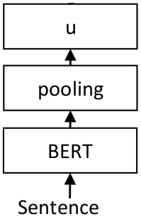

# Training Overview

Each task is unique, and having sentence / text embeddings tuned for that specific task greatly improves the performance.

SentenceTransformers was designed in such way that fine-tuning your own sentence / text embeddings models is easy. It provides most of the building blocks that you can stick together to tune embeddings for your specific task.

Sadly there is no single training strategy that works for all use-cases. Instead, which training strategy  to use greatly depends on your available data and on your target task.

In the **Training** section, I will discuss the fundamentals of training your own embedding models with SentenceTransformers. In the **Training Examples** section, I will provide examples how to tune embedding models for common real-world applications.

## Network Architecture

For sentence / text embeddings, we want to map a variable length input text to a fixed sized dense vector. The most basic network architecture we can use is the following:




We feed the input sentence or text into a transformer network like BERT. BERT produces contextualized word embeddings for all input tokens in our text. As we want a fixed-sized output representation (vector u), we need a pooling layer. Different pooling options are available, the most basic one is mean-pooling: We simply average all contextualized word embeddings BERT is giving us. This gives us a fixed 768 dimensional output vector independet how long our input text was.

The depicted architecture, consisting on a BERT layer and a pooling layer is one final SentenceTransformer model.

## Creating Networks from Scratch
 
 In the quick start & usage examples, we used pre-trained SentenceTransformer models that already come with a BERT layer and a pooling layer.
 
 But we can create the networks architectures from scratch by defining the individual layers. For example, the following code would create the depicted network architecture:
 
```python
from sentence_transformers import SentenceTransformer, models

word_embedding_model = models.Transformer('bert-base-uncased', max_seq_length=256)
pooling_model = models.Pooling(word_embedding_model.get_word_embedding_dimension())

model = SentenceTransformer(modules=[word_embedding_model, pooling_model])
```

First we define our individual layers, in this case, we define 'bert-base-uncased' as the *word_embedding_model*. We limit that layer to a maximal sequence length of 256, texts longer than that will be truncated. Further, we create a (mean) pooling layer. We create a new *SentenceTransformer* model by calling `SentenceTransformer(modules=[word_embedding_model, pooling_model])`. For the *modules* parameter, we pass a list of layers which are executed consecutively. Input text are first passed to the first entry (*word_embedding_model*). The output is then passed to the second entry (*pooling_model*), which then returns our sentence embedding.

We can also construct more complex models:
```python
from sentence_transformers import SentenceTransformer, models
from torch import nn

word_embedding_model = models.Transformer('bert-base-uncased', max_seq_length=256)
pooling_model = models.Pooling(word_embedding_model.get_word_embedding_dimension())
dense_model = models.Dense(in_features=pooling_model.get_sentence_embedding_dimension(), out_features=256, activation_function=nn.Tanh())

model = SentenceTransformer(modules=[word_embedding_model, pooling_model, dense_model])
```

Here, we add a on top of the pooling layer a fully connected dense layer with Tanh activation, which performs a down-project to 256 dimensions. Hence, embeddings by this model will only have 256 instead of 768 dimensions.

For all available building blocks see [» Models Package Reference](../package_reference/models.md)

## Training Data 
 
 To represent our training data, we use the `InputExample` class to store training examples. As parameters, it accepts texts, which is a list of strings representing our pairs (or triplets). Further, we can also pass a label (either float or int). The following shows a simple example, where we pass text pairs to `InputExample` together with a label indicating the semantic similarity.
 
 ```python
from sentence_transformers import SentenceTransformer, InputExample
from torch.utils.data import DataLoader

model = SentenceTransformer('distilbert-base-nli-mean-tokens')
train_examples = [InputExample(texts=['My first sentence', 'My second sentence'], label=0.8),
    InputExample(texts=['Another pair', 'Unrelated sentence'], label=0.3)]
train_dataloader = DataLoader(train_examples, shuffle=True, batch_size=16)
 ```

We wrap our `train_examples` with the standard PyTorch `DataLoader`, which shuffles our data and produces batches of certain sizes.


 
## Loss Functions

The loss function plays a critical role when fine-tuning the model. It determines how well our embedding model will work for the specific downstream task.

Sadly there is no "one size fits all" loss function. Which loss function is suitable depends on the available training data and on the target task.


To fine-tune our network, we need somehow to tell our network which sentence pairs are similar, and should be close in vector space, and which pairs are dissimilar, and should be far away in vector space.

The most simple way is to have sentence pairs annotated with a score indicating their similarity, e.g. on a scale 0 to 1. We can then train the network with a Siamese Network Architecture (for details see: [Sentence-BERT: Sentence Embeddings using Siamese BERT-Networks](https://arxiv.org/abs/1908.10084))


For each sentence pair, we pass sentence A and sentence B through our network which yields the embeddings *u* und *v*. The similarity of these embeddings is computed using cosine similarity and the result is compared to the gold similarity score. This allows our network to be fine-tuned and to recognize the similarity of sentences.


A minimal example with `CosineSimilarityLoss` is the following:
```python
from sentence_transformers import SentenceTransformer, InputExample, losses
from torch.utils.data import DataLoader

#Define the model. Either from scratch of by loading a pre-trained model
model = SentenceTransformer('distilbert-base-nli-mean-tokens')

#Define your train examples. You need more than just two examples...
train_examples = [InputExample(texts=['My first sentence', 'My second sentence'], label=0.8),
    InputExample(texts=['Another pair', 'Unrelated sentence'], label=0.3)]

#Define your train dataset, the dataloader and the train loss
train_dataloader = DataLoader(train_examples, shuffle=True, batch_size=16)
train_loss = losses.CosineSimilarityLoss(model)

#Tune the model
model.fit(train_objectives=[(train_dataloader, train_loss)], epochs=1, warmup_steps=100)
```


We tune the model by calling model.fit(). We pass a list of `train_objectives`, which constist of tuples `(dataloader, loss_function)`. We can pass more than one tuple in order to perform multi-task learning on several datasets with different loss functions.

The `fit` method accepts the following parameter:

```eval_rst
.. autoclass:: sentence_transformers.SentenceTransformer
    :members: fit
```

## Evaluators

During training, we usually want to measure the performance to see if the performance improves. For this, the *[sentence_transformers.evaluation](../package_reference/evaluation)* package exists. It contains various evaluators which we can pass to the `fit`-method. These evaluators are run periodically during training. Further, they return a score and only the model with the highest score will be stored on disc.

The usage is simple:
```python
from sentence_transformers import evaluation
sentences1 = ['This list contains the first column', 'With your sentences', 'You want your model to evaluate on']
sentences2 = ['Sentences contains the other column', 'The evaluator matches sentences1[i] with sentences2[i]', 'Compute the cosine similarity and compares it to scores[i]']
scores = [0.3, 0.6, 0.2]

evaluator = evaluation.EmbeddingSimilarityEvaluator(sentences1, sentences2, scores)

# ... Your other code to load training data

model.fit(train_objectives=[(train_dataloader, train_loss)], epochs=1, warmup_steps=100, evaluator=evaluator, evaluation_steps=500)
```


### Continue Training on Other Data
[training_stsbenchmark_continue_training.py](https://github.com/UKPLab/sentence-transformers/blob/master/examples/training/sts/training_stsbenchmark_continue_training.py) shows an example where training on a fine-tuned model is continued. In that example, we use a sentence transformer model that was first fine-tuned on the NLI dataset and then continue training on the training data from the STS benchmark.

First, we load a pre-trained model from the server:
```python
model = SentenceTransformer('bert-base-nli-mean-tokens')
```


The next steps are as before. We specify training and dev data:
```python
train_dataloader = DataLoader(train_samples, shuffle=True, batch_size=train_batch_size)
train_loss = losses.CosineSimilarityLoss(model=model)

evaluator = EmbeddingSimilarityEvaluator.from_input_examples(sts_reader.get_examples('sts-dev.csv'))
```

In that example, we use CosineSimilarityLoss, which computes the cosine similarity between two sentences and compares this score with a provided gold similarity score.

Then we can train as before:
```python
model.fit(train_objectives=[(train_dataloader, train_loss)],
          evaluator=evaluator,
          epochs=num_epochs,
          evaluation_steps=1000,
          warmup_steps=warmup_steps,
          output_path=model_save_path)
```


## Loading Custom SentenceTransformer Models
Loading trained models is easy. You can specify a path:
```python
model = SentenceTransformer('./my/path/to/model/')
```
Note: It is important that a / or \ is the path, otherwise, it is not recognized as a path.

You can also host the training output on a server and download it:
 ```python
model = SentenceTransformer('http://www.server.com/path/to/model/my_model.zip')
```
With the first call, the model is downloaded and stored in the local torch cache-folder (`~/.cache/torch/sentence_transformers`). In order to work, you must zip all files and subfolders of your model. 


## Multitask Training
This code allows multi-task learning with training data from different datasets and with different loss-functions. For an example, see [training_multi-task.py](https://github.com/UKPLab/sentence-transformers/blob/master/examples/training/other/training_multi-task.py).


## Adding Special Tokens

Depending on the task, you might want to special tokens to the tokenizer and the Transformer model. You can use the following code-snippet to achieve this:
```python
from sentence_transformers import SentenceTransformer, models
word_embedding_model = models.Transformer('bert-base-uncased')

tokens = ["[DOC]", "[QRY]"]
word_embedding_model.tokenizer.add_tokens(tokens, special_tokens=True)
word_embedding_model.auto_model.resize_token_embeddings(len(word_embedding_model.tokenizer))

pooling_model = models.Pooling(word_embedding_model.get_word_embedding_dimension())
model = SentenceTransformer(modules=[word_embedding_model, pooling_model])
```

If you want to extend the vocabulary for an existent SentenceTransformer model, you can use the following code:
```python
from sentence_transformers import SentenceTransformer, models
model = SentenceTransformer('paraphrase-distilroberta-base-v1')
word_embedding_model = model._first_module()

tokens = ["[DOC]", "[QRY]"]
word_embedding_model.tokenizer.add_tokens(tokens, special_tokens=True)
word_embedding_model.auto_model.resize_token_embeddings(len(word_embedding_model.tokenizer))
```

In the above example, the two new tokens `[DOC]` and `[QRY]` are added to the model. Their respective word embeddings are intialized randomly. It is advisable to then fine-tune the model on your downstream task.
